# 22MIC7013

Backend development assessment covering logging middleware, REST APIs, and system design.

---

## Repository Structure

```
22MIC7013/
├── logging_middleware/           # Reusable logging package
├── vehicle_maintence_scheduler/  # Vehicle maintenance REST API
├── notification_app_be/          # Notification system REST API
├── notification_system_design.md # System architecture document
├── images/                       # API screenshots
└── README.md
```

---

## Quick Start

### Prerequisites

- [Bun](https://bun.sh) runtime installed
- Node.js 18+ (optional, for compatibility)

### Setup Each Project

```bash
# Logging Middleware
cd logging_middleware
bun install
cp .env.example .env
# Edit .env with credentials

# Vehicle Maintenance Scheduler
cd vehicle_maintence_scheduler
bun install
cp .env.example .env
bun dev   # Runs on port 3000

# Notification App Backend
cd notification_app_be
bun install
cp .env.example .env
bun dev   # Runs on port 3001
```

---

## Tech Stack

| Layer | Technology |
|-------|-----------|
| Runtime | Bun |
| Framework | Express.js |
| Language | TypeScript |
| Architecture | Routes → Controllers → Services → Repository |

---

## Environment Variables

Each project requires a `.env` file with the following keys:

```env
LOG_BASE_URL=http://4.224.186.213/evaluation-service
LOG_EMAIL=your_email
LOG_NAME=your_name
LOG_ROLL_NO=your_roll_no
LOG_ACCESS_CODE=your_access_code
LOG_CLIENT_ID=your_client_id
LOG_CLIENT_SECRET=your_client_secret
```

> Never commit `.env` files. Use `.env.example` as a template.

---

## Architecture

All projects follow a strict layered architecture:

```
Routes → Controllers → Services → Repository → Middleware → Utils
```

- **Routes** — define endpoints, delegate to controllers
- **Controllers** — parse request, call service, return response
- **Services** — business logic
- **Repository** — data access layer
- **Middleware** — logging, error handling, validation
- **Utils** — shared helpers

---

## Projects

---

### 1. Logging Middleware

Reusable logging package with:

- Token caching (avoids auth call per log)
- Input validation
- Retry logic with exponential backoff
- Graceful failure handling

**Usage**

```typescript
import { Log } from "../logging_middleware/src";

Log("backend", "info", "handler", "GET /vehicles handler invoked");
Log("backend", "error", "db", "DB query failed — vehicle ID not found");
```

---

### 2. Vehicle Maintenance Scheduler

REST API for vehicle and maintenance management running on **port 3000**.

#### Endpoints

| Method | Route | Description |
|--------|-------|-------------|
| POST | `/vehicles` | Create a vehicle |
| GET | `/vehicles` | List all vehicles |
| GET | `/vehicles/:id` | Get vehicle by ID |
| PUT | `/vehicles/:id` | Update vehicle |
| DELETE | `/vehicles/:id` | Delete vehicle |
| POST | `/maintenance` | Create maintenance record |
| GET | `/maintenance` | List all maintenance records |
| GET | `/vehicles/:id/maintenance` | Get maintenance by vehicle |
| PATCH | `/maintenance/:id` | Update maintenance status |

---

#### POST `/vehicles`

Request:

```json
{
  "make": "Toyota",
  "model": "Innova",
  "year": 2020,
  "plate": "TS09AB1234",
  "ownerId": "owner-001"
}
```

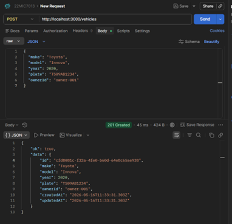

---

#### POST `/vehicles` — second entry

Request:

```json
{
  "make": "MG Hector",
  "model": "Base Model",
  "year": 2020,
  "plate": "AB99AB7864",
  "ownerId": "owner-002"
}
```

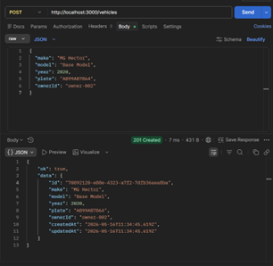

---

#### GET `/vehicles`

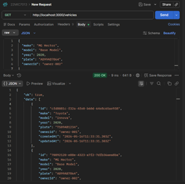

---

#### GET `/vehicles/:id`

```
GET /vehicles/cfd8081c-f32a-4fe0-b60d-64e8c65ae938
```

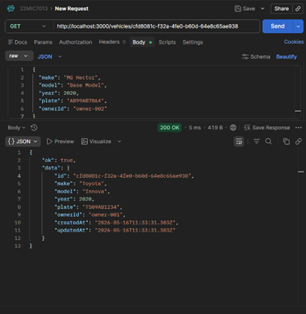

---

#### PUT `/vehicles/:id`

```
PUT /vehicles/cfd8081c-f32a-4fe0-b60d-64e8c65ae938
```

Request:

```json
{
  "mileage": 47000
}
```

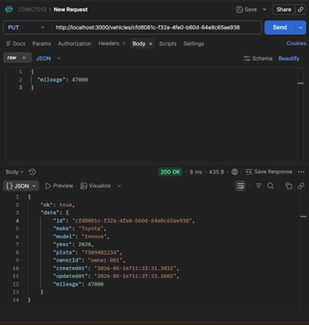

---

#### POST `/maintenance`

Request:

```json
{
  "vehicleId": "cfd8081c-f32a-4fe0-b60d-64e8c65ae938",
  "type": "oil_change",
  "desc": "Regular oil change due",
  "scheduledAt": "2026-06-01"
}
```

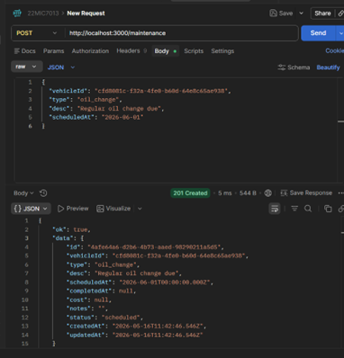

---

#### GET `/maintenance`

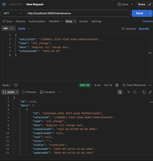

---

#### GET `/vehicles/:id/maintenance`

```
GET /vehicles/cfd8081c-f32a-4fe0-b60d-64e8c65ae938/maintenance
```

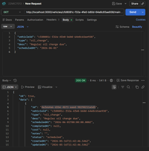

---

### 3. Notification App Backend

REST API for notification management running on **port 3001**.

#### Endpoints

| Method | Route | Description |
|--------|-------|-------------|
| POST | `/users` | Create a user |
| GET | `/users` | List all users |
| POST | `/notifications` | Create a notification |
| GET | `/notifications` | List all notifications |
| GET | `/notifications/:id` | Get notification by ID |
| PATCH | `/notifications/:id/read` | Mark notification as read |
| DELETE | `/notifications/:id` | Delete notification |

---

#### POST `/users`

Request:

```json
{
  "name": "Admin User",
  "email": "admin@system.com"
}
```

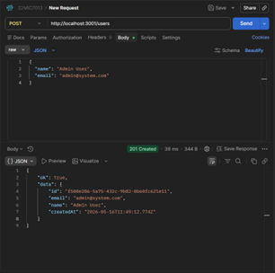

---

#### GET `/users`

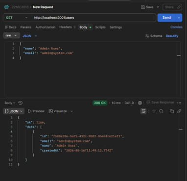

---

#### POST `/notifications`

Request:

```json
{
  "userId": "f508e286-5a75-432c-9b82-0b60fc621e11",
  "type": "alert",
  "title": "Server Alert",
  "body": "CPU usage exceeded 90%",
  "priority": "high"
}
```

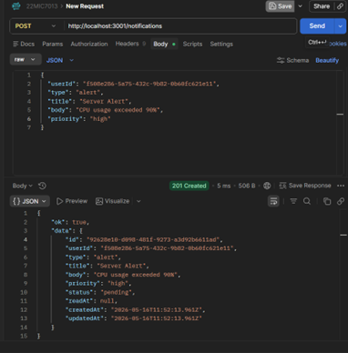

---

#### GET `/notifications/:id`

```
GET /notifications/92628e10-d098-481f-9273-a3d92b6611ad
```

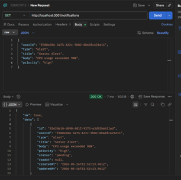

---

### 4. System Design

`notification_system_design.md` covers:

- Multi-channel delivery (email, SMS, push, in-app)
- Message queuing and worker architecture
- Database schema design
- Reliability patterns (retry, circuit breaker)
- Monitoring and observability

---

## Logging

Every significant lifecycle event is logged via the `Log()` middleware:

| Event | Level |
|-------|-------|
| Route invoked | `info` |
| Service operation | `debug` / `info` |
| DB operation | `debug` |
| Validation failure | `warn` |
| Caught error | `error` |
| Fatal failure | `fatal` |
| Successful completion | `info` |
